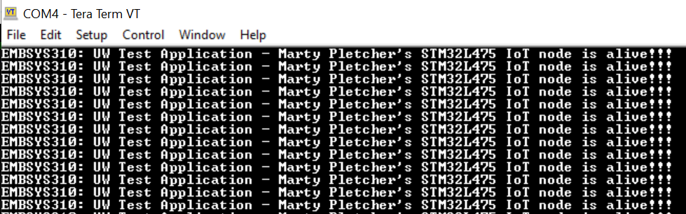

# Hello World Program
I followed the instructions to install IAR and the rest of the *EMBSYS 310* toolchain, and to run the embedded system "Hello World" program.

## Program Output
Below is an image showing the output of the "Hello world" program.

