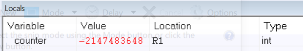
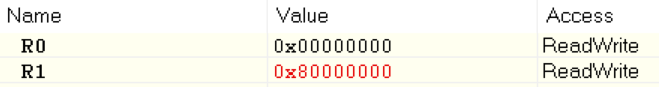
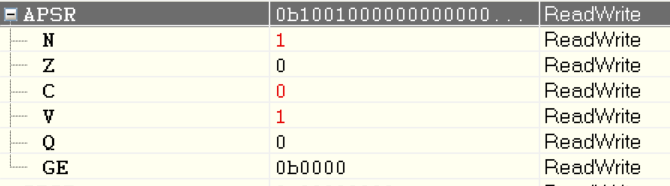
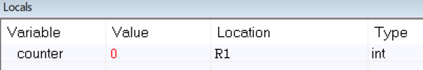
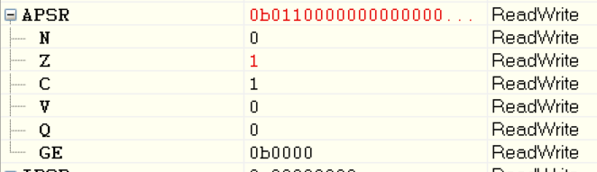
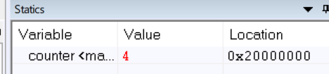
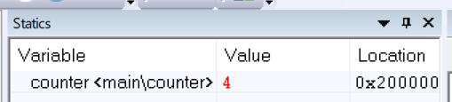

# EMBSYS 310 - AU20 Assignment 02
This is the directory containing my work for Assignment 02.

See the program for the assignment here [DebugPractice](https://github.com/pletchm/embsys310/blob/main/assignment02/DebugPractice/main.c)

## Goal
1. Create a new project in the IAR IDE and explore the different debug views.
2. Practice machine instructions, addresses, variables, and pointers. 

```c
int main()
{
    int counter = 0;
    counter++;
    counter++;
    counter++;
    counter++;
    counter++;
    counter++;
    counter++;
    return 0;
}
```

## Exercises
First, create a IAR project with the following project in the `main.c` file.

### 1) Inject 0x7FFFFFFF for the `counter` value in the variable window, then step 
###    through the program ony once to increment the `counter`.

#### a) What is the value of the `counter` from the *"Locals"* window?

`counter` = -2147483648

#### b) What is the value of the `counter` from the *"Registers"* window?

R1 = 0x80000000

#### c) Note down whether N and/or V flags are set in the APSR register. Explain why.
**First some notes:**
*ASPR:* The *Application Program Status Register*. It contains copies the *Arithmetic Logic Unit* (ALU)
status flags.
The *N* flag is set to 1, if the result of the operation is negative, and 0 otherwise.
The *v*  flag is set to 1, if the operation results in overflow, and 0 otherwise.

**Answer:**
Both the *N* and *V* flags are set, because `counter` was initialized to 0x7FFFFFFF
or 2147483647, which is the maximum `int` value. So overflow is expected, and as seen
in *a)*, the result of the operation will be
-2147483648, which is negative.


### 2) If you write all Fs, i.e., 0xFFFFFFFF, in the register value for `counter`,
###    then step through the program once to increment `counter`

#### a) What happens to the value of `counter` in the *"Locals"* view?

`counter` = 0

#### b) Note down whether N and/or V flags are set in the APSR register. Explain why.
Neither the *N* or *V* flag is set, because when R1 is set to 0xFFFFFFFF the overflow
allready occurs imediately before the increment, therefore the initial value of `counter`
is actually -1. Furthermore, the increment brings the value to 0, which is *not* negative.


### 3) Change the `counter` variable type in your code to `unsigned int`. Inject the
###    the value 0x7FFFFFF, then step through the program to increment the counter once.

#### a) What is the value of the `counter` in the *"Locals"* window after incrementing
####    for each value?
`counter` = 2147483648
`counter` = 2147483649
.
.
.
`counter` = 2147483654
#### b) Note down whether N and/or V flags are set in the APSR register. Explain why.
Both the *N* and *V* flags are set, which is interesting because there shouldn't be
overflow. But my assumption is that the processor still sets the flags for overflow
and negative result, because they don't affect the unsigned result at all.

### 4) Change the `counter` variable type in your code to `unsigned`. Inject 0x7FFFFFFF
###    then step through the program to increment the counter once.

#### a) What is the value of the `counter` in the *"Locals"* window after incrementing
####    for each value?
Same as *3.a*

#### b) Note down whether N and/or V flags are set in the APSR register. Explain why.
Same as *3.b*, because `unsigned` and `unsigned int` are synomous.

### 5) Move the `counter` variable outside of `main()` (at the top of the file):

#### a) What is the scope of the variable `counter`?
Global scope.

#### b) Is it still visible in the *"Locals"* view?
No.

#### c) In which window view can we track `counter` now?
The *"Statics"* view.

#### d) What is the address of the `counter` variable in memory?
0x20000000.

### 6) Change the source code to the following, then run the program
###    with the simulator:
```c
int counter = 0x0;

int main()
{
    int* p_int = (int*)0x20000000;
    ++(*p_int);
    ++(*p_int);
    ++(*p_int);
    counter++;
    return 0;
}
```

#### a) What is the value of `counter` at the end of the program (halting at the return 0
####    statement)?
`counter` = 4.


#### b) Explain why the `counter` value has changed?
The pointer `p_int` points to the integer at 0x20000000, which is the address of `counter`.
Via `p_int`, the integer which is initialized to 0, is actually incremented 3 times before
`counter++` is executed, so the final value is 4.

### 7) Change the setting of IAR to run the same program on the evaluation board:


#### a) What is the address where `counter` is stored?
0x20000000.

#### b) Is the `counter` variable stored in RAM or ROM?
RAM (RAM1).

#### c) What is the value of `counter` at the end of the program (halting at the return 0
####    statement)?
`counter` = 4.

