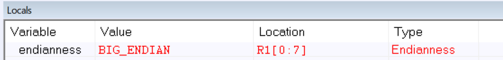
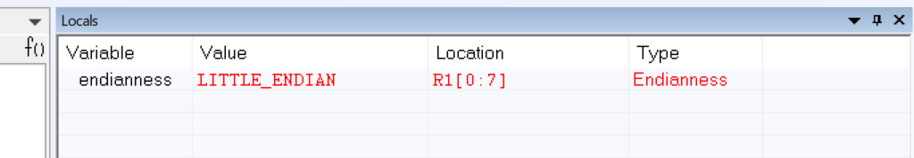

# EMBSYS 310 - AU20 Assignment 04
This is the directory containing my work for Assignment 04.

## Goal
1. Practice the use of bit-banding region.
2. Examine the assembly code generated for a function with multiple parameters.
3. Practice API design, testing, etc.
4. Apply usage of pointers and Endianness.

## Problems:

### 1. Blink LED1 (PA5) at a visible rate using the bit-band region to enable the clock to port A. 
See the code here [BitBanding/main.c](https://github.com/pletchm/embsys310/blob/main/assignment04/BitBanding/main.c).

#### a. What instructions does the compiler produce in assembly for "writing" to the GPIO bit
when using bit-band adress?
**Three assembly instructions:**
```assembly
MOVS    R0, #1
LDR.N   R1, [PC, #0x48]
STR     R0, [R1]
```
   
#### b. What were the instructions produced when writing to the GPIOx_ODR without using bit-banding.
```assembly
LDR.N   R0, [PC, #0x4c]
LDR     R1, [R0]
ORRS.W  R1, R1, #1
STR     R1, [R0]
```

### 2. Create a function `func1` with 5 arguments and call it from another function `func2`.
###    Trace through the assembler and note:
The code for this problem is here:
[ExtraArgs/main.c](https://github.com/pletchm/embsys310/blob/main/assignment04/ExtraArgs/main.c).

#### a. How does the "calling" function `func2` pass the values to the
####	"called" function `func1`?
```assembly
MOVS   R3, R7
```
This command writes the value from `R7`, the local variable `arg0` value, i.e., `2`, in `func2`, 
to `R3`. The `S` suffix of the `MOV` means that flags get updated.

The other arguments are passed in a similar way:

```assembly
MOVS   R2, R6
```
Where `R6` corresponds to the `arg1` value, i.e., `3`.

```assembly
MOVS   R1, R5
```
where `R5` corresponds to the `arg1` value, i.e., `4`.

```assembly
MOVS   R0, R4
```
where `R4` corresponds to the `arg0` value, i.e., `5`. 

The last argument, from variable `arg4` that is in `R8`, is actually passed to `func1` using the stack
pointer `SP`:
```assembly
STR.W  R8, [SP]
```
This command stores the register word in `R8` to the stack pointer `SP`.

#### b. What extra code did the compiler generate before calling the function `func1` with
####	the multiple arguments?
```assembly
BL     func1
```
Branch with Link to `func1`.

#### c. What extra code did the compiler generate inside the "called" function `func1`
###	with the multiple list of arguments?
```assembly
PUSH.W  {R4-R8, LR}
MOVS    R4, R0
LDR     R5, [SP, #0x18]
	   ```

#### d. Any other observations?
There are `POP` commands after both the `func1` call and the `func2` call.
After `func1`:
```assembly
POP.W  {R4-R8, PC}
```
After `func2`:
```assembly
POP.W  {R0, R1, R4-R8, PC}
```

#### 3. Implement and test a stack data structure.
The code for this problem is here:

* [Stack/main.c](https://github.com/pletchm/embsys310/blob/main/assignment04/Stack/main.c)
* [Stack/stack.c](https://github.com/pletchm/embsys310/blob/main/assignment04/Stack/stack.c)
* [Stack/stack.h](https://github.com/pletchm/embsys310/blob/main/assignment04/Stack/stack.h)

#### 4. Using the power of pointers and type casting, create a function that can determine
####    if a computer is big-endian or little-endian.
The code for this problem is here:
[Endianness/main.c](https://github.com/pletchm/embsys310/blob/main/assignment04/Endianness/main.c)

**The image below shows the function detecting Big-endianness on the Simulator.**



**The image below shows the function detecting Little-endianness on the Simulator.**



