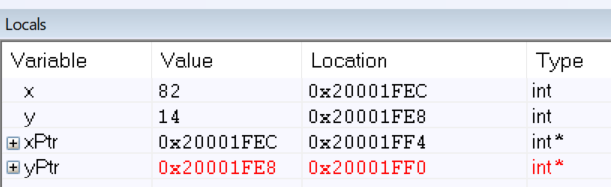
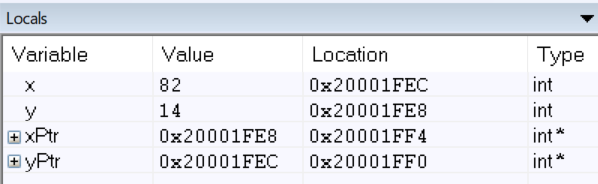
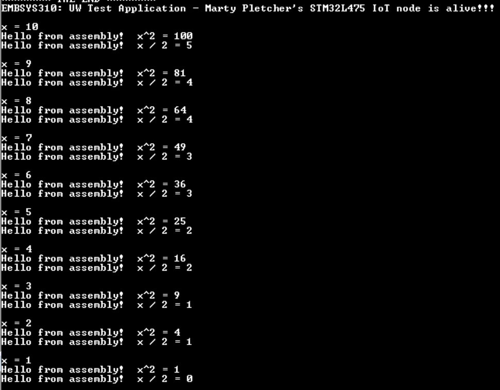
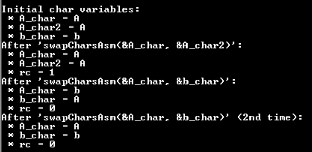

# EMBSYS 310 - AU20 Assignment 05
This is the directory containing my work for Assignment 05.

## Goal
1. To gain in depth understanding of the pass-by-value for function arguments in C.
2. To gain hands-on experience with the ARM Cortex-M4 assembly language.

## Problems: 

### 1. Swapping pointers.
_Create a function in C that allows swapping of two pointers._

Here is the code for this problem:
[SwapPointers/main.c](https://github.com/pletchm/embsys310/blob/main/assignment05/SwapPointers/main.c).

#### a. Explain what the main function does.
_Explain what the "main" function does in order to setup the input arguments prior to calling
the "swap_pointer" function._

Since the internals of the `swap` function actually were not altered at all, the main function,
needs to pass the address of the pointers and cast them integers-pointers (i.e., `int*`). The C code
below shows the function call.
```c
int x = 82;
int y = 14;
int* xPtr = &x;
int* yPtr = &y;
swap_pointer((int*) &xPtr, (int*) &yPtr);
```
**NOTE:**
Another way to do this (and the preferable way) would be to change the signature of the function
so that it takes pointers-to-pointers-to-integers, i.e., `int**`. Then function would look like

```c
void swap_pointer(int** a, int** b);
```
and woud be called like
```c
int 
swap_pointer(&xPtr, &yPtr);
```
This way no type-casting is needed. 

#### b. The "R0" and "R1" registers during the swap
_What are the values in "R0" and "R1" when "swap_pointer" is called?_

When the `swap_pointer` function is called, the register `R0` contains the first argument, the
address of the first pointer, and the register `R1` contains the second argument, the address
of the second pointer.


#### c. Screenshot of "Locals" View.
_Share a screenshot of the local variables inside of "main" after the function
"swap_pointer" returns showing the values of the pointers and what they are pointing to._

The image below shows the "Locals" view before the `swap_pointer` function is called.


The image below shows the "Locals" view after the `swap_pointer` function is called.


### 2. New "divAsm.s" Assembly code file
_Create a new file `divAsm.s` and add the file to the same HelloWorld project
above (i.e., the Module 06 demo)._

Here is the Assembly code for this problem:
[divAsm.s](https://github.com/pletchm/embsys310/blob/main/assignment05/Module06_Demo12_HelloWorld_Assembly/Src/divAsm.s).

Here is the C code where the `divAsm` assembly function is used:
[main.c (line 135)](https://github.com/pletchm/embsys310/blob/main/assignment05/Module06_Demo12_HelloWorld_Assembly/Src/main.c#L135).

Also note that the function must be declared in the C code, which is done on
[line 59](https://github.com/pletchm/embsys310/blob/main/assignment05/Module06_Demo12_HelloWorld_Assembly/Src/main.c#L59).

#### a. Assembly demo code.
_Start with the Assembly demo code shared in class._

#### b. Divide input arg by 2.
_Write the assembly code to take an input argument, divide it by 2, and return
the result._

#### c. Invoke "PrintString" function.
_Invoke the function `PrintString` from within `divAsm` before doing the division
computation._

#### d. Assembly code comments.
_Add comment for every statement in your assembly code._

#### e. Invoke "divAsm" function. 
_Invoke the function`divAsm` inside `main` from `main.c`._

#### f. On the Evaluation Board.
_Run the program on the board and capture a screenshot of the **TeraForm** output,
which should show the result of the `divAsm`._

The image below is a screen shot of the Tera Form output showing the use of the `divAsm` assembly
function.


### 3. "swapCharsAsm" Assembly Function 
_Implement a swap function in assembly and call it `swapCharsAsm`._

#### a. Parameters.
_It takes as input two variables of char data type each and swaps the two chars._

#### b. Comments.
_Add a comment for every statement in the assembly function code._

#### c. Return.
_Return 0 if the two chars are identical; otherwise, return 1._

Here is the Assembly code for this problem:
[swapCharsAsm.s](https://github.com/pletchm/embsys310/blob/main/assignment05/Module06_Demo12_HelloWorld_Assembly/Src/swapCharsAsm.s).

Here is the C code where the `swapCharsAsm` assembly function is used:
[main.c (lines 148-174)](https://github.com/pletchm/embsys310/blob/main/assignment05/Module06_Demo12_HelloWorld_Assembly/Src/main.c#L148-L174).

Also note that the function must be declared in the C code, which is done on
[line 60](https://github.com/pletchm/embsys310/blob/main/assignment05/Module06_Demo12_HelloWorld_Assembly/Src/main.c#L60).

The image below is a screen shot of the Tera Form output showing the use of the `swapCharsAsm` function.


